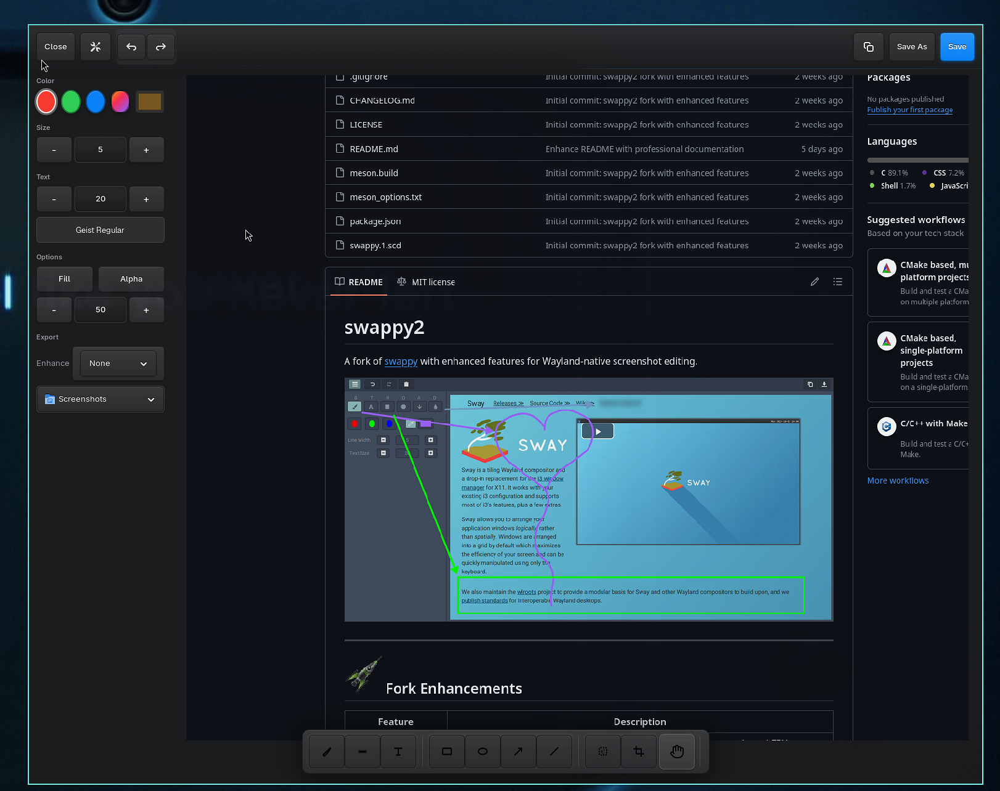

# swappy2

A fork of [swappy](https://github.com/jtheoof/swappy) with enhanced features for Wayland-native screenshot editing.

(https://github.com/johnzfitch/swappy2/blob/master/docs/images/screenshot-2026-01-18_19-34-58.png))

---

##  Fork Enhancements

| Feature | Description |
|---------|-------------|
| **Scale2x Sharp Zoom** | Text and UI elements remain crisp when zoomed using viewport-based EPX algorithm (no blurry bilinear interpolation) |
| **Zoom & Pan** | Scroll wheel to zoom, middle-mouse drag to pan, Space/0/1 to reset |
| **Crop Tool** | Select and crop regions with visual overlay |
| **PNG Compression** | Level 9 compression for smaller file sizes |
| **Desktop Notifications** | Shows notification with filename after saving |
| **Additional Keybinds** | Ctrl+R for redo |

---

##  2026 Strategies

Modern screenshot editing built on proven foundations:

| Strategy | Implementation |
|----------|----------------|
| **Wayland-Native** | Zero X11 dependencies - pure Wayland protocol integration |
| **Privacy-First** | All processing local, no cloud uploads, no telemetry |
| **Edge-Preserving Scale** | EPX/Scale2x algorithm preserves text clarity at any zoom level |
| **Minimal Footprint** | Single binary, C-native performance, ~2MB installed |
| **Composable Design** | Unix philosophy - pipes with grim, slurp, pngquant, wl-copy |

---

##  Usage

Output of `grim` (or any tool outputting an image file):

```sh
grim -g "$(slurp)" - | swappy -f -
```

Edit a PNG file:

```sh
swappy -f "~/Desktop/screenshot.png"
```

Print final surface to stdout (composable with other tools):

```sh
grim -g "$(slurp)" - | swappy -f - -o - | pngquant -
```

Capture specific window under Sway:

```sh
grim -g "$(swaymsg -t get_tree | jq -r '.. | select(.pid? and .visible?) | .rect | "\(.x),\(.y) \(.width)x\(.height)"' | slurp)" - | swappy -f -
```

---

##  Configuration

Config file location: `$XDG_CONFIG_HOME/swappy/config` or `$HOME/.config/swappy/config`

### Default Configuration

```ini
[Default]
save_dir=$HOME/Desktop
save_filename_format=swappy-%Y%m%d-%H%M%S.png
show_panel=false
line_size=5
text_size=20
text_font=sans-serif
paint_mode=brush
early_exit=false
fill_shape=false
auto_save=false
custom_color=rgba(193,125,17,1)
transparent=false
transparency=50
```

### Configuration Options

| Option | Description | Values |
|--------|-------------|--------|
| `save_dir` | Screenshot save directory (supports env vars) | Path |
| `save_filename_format` | Filename template with strftime(3) format | String |
| `show_panel` | Show paint panel on startup | true/false |
| `line_size` | Default stroke width | 1-50 |
| `text_size` | Default text size | 10-50 |
| `text_font` | Pango font string | Font name |
| `paint_mode` | Initial tool | brush/text/rectangle/ellipse/arrow/blur |
| `early_exit` | Exit after save/copy | true/false |
| `fill_shape` | Fill rectangles and ellipses | true/false |
| `auto_save` | Auto-save on exit | true/false |
| `custom_color` | Default custom color | rgba() |
| `transparency` | Draw transparency level | 0-100 |

---

##  Keyboard Shortcuts

### Panel & Tools

| Key | Action |
|-----|--------|
| `Ctrl+b` | Toggle Paint Panel |
| `b` | Brush |
| `e` `t` | Text (Editor) |
| `r` `s` | Rectangle (Square) |
| `c` `o` | Ellipse (Circle) |
| `a` | Arrow |
| `d` | Blur (Droplet) |

### Colors & Stroke

| Key | Action |
|-----|--------|
| `R` | Red |
| `G` | Green |
| `B` | Blue |
| `C` | Custom Color |
| `-` | Reduce Stroke |
| `+` | Increase Stroke |
| `=` | Reset Stroke |
| `f` | Toggle Fill |
| `x` `k` | Clear Paints |
| `T` | Toggle Transparency |

### Edit Operations

| Key | Action |
|-----|--------|
| `Ctrl` | Center shape on draw start |
| `Ctrl+z` | Undo |
| `Ctrl+Shift+z` / `Ctrl+y` / `Ctrl+r` | Redo |
| `Ctrl+s` | Save to file |
| `Ctrl+c` | Copy to clipboard |
| `Escape` / `q` / `Ctrl+w` | Quit |

###  Zoom & Pan

| Input | Action |
|-------|--------|
| Scroll Up/Down | Zoom in/out (cursor-centered) |
| Middle Mouse Drag | Pan image |
| `Space` / `0` / `1` | Reset zoom and pan |

---

##  Building from Source

### Dependencies

| Package | Purpose |
|---------|---------|
| meson | Build system |
| ninja | Build backend |
| cairo | 2D graphics |
| pango | Text rendering |
| gtk3 | GUI toolkit |
| glib2 | Core utilities |
| scdoc | Man page generation |

### Optional Dependencies

| Package | Purpose |
|---------|---------|
| wl-clipboard | Persistent clipboard (recommended) |
| otf-font-awesome | Tool icons |

### Build Commands

```sh
meson setup build
ninja -C build
```

### Install

```sh
sudo ninja -C build install
```

---

##  Architecture

```
┌─────────────────────────────────────────────────────┐
│                    GTK3 Window                       │
├─────────────────────────────────────────────────────┤
│  ┌─────────────┐  ┌─────────────────────────────┐   │
│  │ Paint Panel │  │      Drawing Canvas         │   │
│  │             │  │  ┌───────────────────────┐  │   │
│  │  [Brush]    │  │  │                       │  │   │
│  │  [Text]     │  │  │   Cairo Surface       │  │   │
│  │  [Rect]     │  │  │   + Scale2x Zoom      │  │   │
│  │  [Ellipse]  │  │  │   + Viewport Pan      │  │   │
│  │  [Arrow]    │  │  │                       │  │   │
│  │  [Blur]     │  │  └───────────────────────┘  │   │
│  └─────────────┘  └─────────────────────────────┘   │
└─────────────────────────────────────────────────────┘
```

### Scale2x Algorithm

The EPX/Scale2x algorithm preserves edge clarity when zooming:

```
Input pixel P with neighbors:    Output 2x2 block:
      A                              1  2
    C P B           →                3  4
      D

Rules:
  1 = (C==A && C!=D && A!=B) ? A : P
  2 = (A==B && A!=C && B!=D) ? B : P
  3 = (D==C && D!=B && C!=A) ? C : P
  4 = (B==D && B!=A && D!=C) ? D : P
```

---

##  Limitations

| Limitation | Details |
|------------|---------|
| **Clipboard** | Without wl-clipboard, content is lost when swappy closes (GTK 3.24 Wayland limitation) |
| **Fonts** | Requires Font Awesome 5 for panel icons (`otf-font-awesome` on Arch) |
| **Output Format** | PNG only |

---

##  Contributing

Pull requests welcome. This project uses [conventional commits](https://www.conventionalcommits.org/en/v1.0.0/) for changelog generation.

### Development Setup

```sh
git clone https://github.com/johnzfitch/swappy2.git
cd swappy2
meson setup build
ninja -C build
./build/swappy -f /path/to/image.png
```

---

## License

MIT

---

## Links

| Resource | URL |
|----------|-----|
| Original swappy | https://github.com/jtheoof/swappy |
| grim (screenshot) | https://github.com/emersion/grim |
| slurp (region select) | https://github.com/emersion/slurp |
| sway | https://github.com/swaywm/sway |
| wl-clipboard | https://github.com/bugaevc/wl-clipboard |
